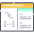

# <span style="vertical-align: sub"></span> Library Application <span style="vertical-align: sub"></span>

### <span style="vertical-align: middle"></span> Project description:

This is a simple implementation of a library application, created using Spring Boot, SQL database, REST principles and supports CRUD operations.
All data is displayed to user in JSON format.

### <span style="vertical-align: middle"></span> Features:

This app uses database to store information about books and their authors.
Each book can have several authors and each authors can have several books.

Supported operations:
- create/update/delete book
- create/update/delete author
- show all books by author name
- show most selling book by author name
- show most published book by author name
- show list of most selling book by partial author name
- show list of most published book by partial author name
- show list of most successful book (sold / published books' ratio) by partial author name
- show most successful author (<sum of all books' success ratio> / <number of books> ratio) by partial author name

### <span style="vertical-align: middle"></span> Structure:

1. `main.java` package folders:
    - `controller` - contains presentation layer's classes
    - `dto` - contains models' request and response DTOs
    - `model` - contains models of book and author
    - `repository` - contains database layer's interfaces and classes
    - `service` - contains business logic layer's interfaces/classes and DTO mappers

2. `resources` package:
    - Spring Boot configuration folders
    - properties for connecting to database and creating/managing required schema and tables
    - icons for `README.md`

### <span style="vertical-align: middle"></span> List of endpoints:

- `POST`: /authors - add author
- `PUT`: /authors/{id} - update author
- `DELETE`: /authors/{id} - delete author
- `POST`: /books - add book
- `PUT`: /books/{id} - update book
- `DELETE`: /books/{id} - delete book
- `GET`: /authors - show all books by author name
- `GET`: /top-sold/authors - show most selling book by author name
- `GET`: /top-published/authors - show most published book by author name
- `GET`: /by-sold/authors - show list of most selling book by partial author name
- `GET`: /by-published/authors - show list of most published book by partial author name
- `GET`: /by-success-rate/authors - show list of most successful book (sold/published ratio) by partial author name
- `GET`: /top-author - show most successful author (<sum of all books' success ratio/number of books> ratio) by partial author name

### <span style="vertical-align: middle"></span> Technologies:

- `Spring Boot`
- `Hibernate`
- `Maven`
- `JPA`
- `REST`
- `MySQL`

### <span style="vertical-align: middle"></span> Instructions to run the project

- Install IDE to your PC
- Clone the project to your IDE (e.g. IntelliJ IDEA)
- Install MySQL to your PC and create new MySQL connection
- Change parameters in `application.properties`: `spring.datasource.username`, `spring.datasource.password` for yours (they should match `username` and `password` from your MySQL connection)
- Run the project via Main method - `BooksApplication`
- Use `Postman` and send GET/POST/PUT/DELETE requests

POST request example using Postman:
```
http://localhost:8080/authors - URL
{"authorName":"any name", "birthDate":"any birthdate date", "phone":"any phone", "email":"any email"} - body;
```
